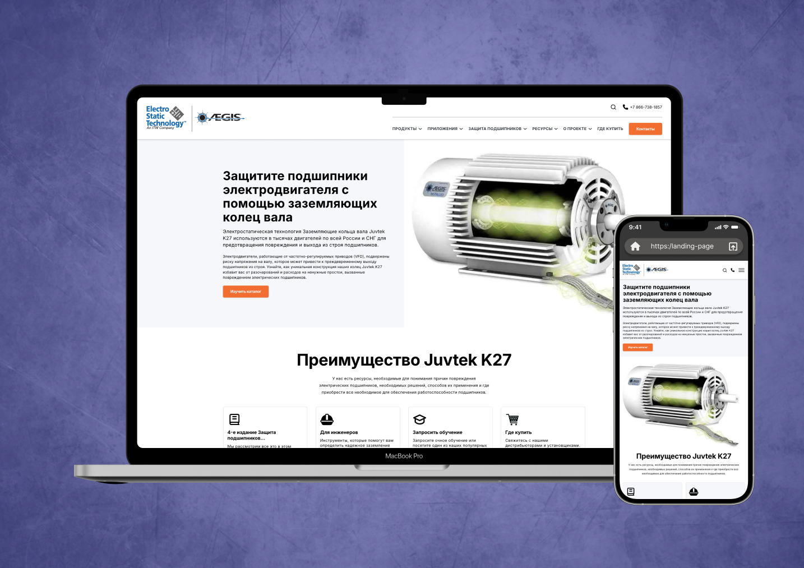

# 🧩 Aegis Electro Static Technology — Shaft Grounding for Motor Bearing Protection

Protect your electric motor bearings with advanced shaft grounding rings. Juvtek K27 shaft grounding rings are trusted in thousands of motors across Russia and the CIS, preventing costly bearing damage and unplanned downtime. Electromotors driven by variable frequency drives (VFDs) are susceptible to shaft voltage buildup, which can lead to premature bearing failure. The innovative design of the Juvtek K27 rings offers reliable electrostatic discharge protection, extending motor life and ensuring uninterrupted operation.

---

<h3>🖼 Preview</h3>

---

<h3>🎯 Project Goals</h3>

- ✅ Build a user-friendly and adaptive website with responsive design that reflects the company’s services
- ✨ Add personality and liveliness to the site through pure JavaScript animations
- ⚡ Ensure high loading speed and cross-browser compatibility (Google Chrome, Safari, Yandex Browser, Opera, Edge, Brave, etc.)
- 🛠 Develop clean, valid, and maintainable code using only standard web technologies to guarantee stability and performance

---

<h3>🧩 Development Features</h3>

- 📐 Semantic **HTML5** markup for well-structured and accessible architecture  
- 🎨 **CSS3 + SCSS (Sass)** for styling with modularity and reusability  
- 🏷️ **BEM methodology** for organized class naming and scalability  
- 📱 Responsive layout with **Flexbox** and **CSS Grid**  
- ⚙️ **JavaScript** for interactive elements and dynamic behavior  
- 🔄 **Gulp + Webpack** for task automation:  
  - SCSS compilation  
  - Minification  
  - Image optimization  
  - Hot-reload during development  

---

<h3>🛠️ Tech Stack</h3>

| Technology         | Purpose                   |
| ------------------ | ------------------------- |
| **HTML5**          | Structure & semantics     |
| **CSS3 / SCSS**    | Styling & maintainability |
| **BEM**            | Clean and scalable code   |
| **Flexbox & Grid** | Responsive design         |
| **JavaScript**     | Dynamic functionality     |
| **Gulp & Webpack** | Build automation          |

---

✨ The chosen **technology stack** ensures stable performance, ease of development, and long-term support.
